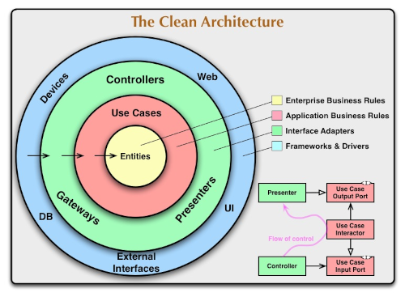
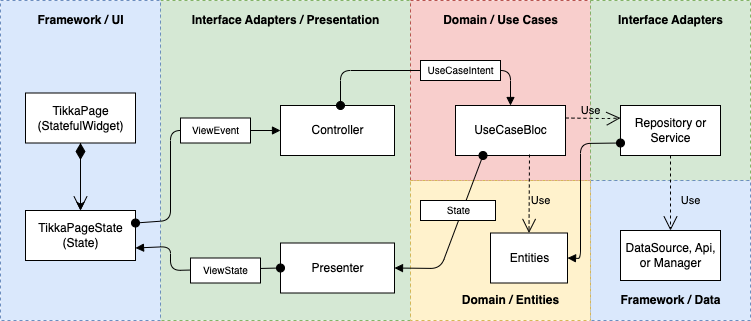

# Tikka


## Introduction

This Flutter library offers a clean and practical implementation of Clean Architecture for Flutter applications. It's designed to help you build maintainable and testable apps by following the core principles described in Robert C. Martin's "Clean Architecture."  A helpful introduction to Clean Architecture can be found on [The Clean Code Blog](https://blog.cleancoder.com/uncle-bob/2012/08/13/the-clean-architecture.html).



### Origins of Library Name

The Tikka library takes its name and logo from the Finnish word for "dart" which is "tikka". "Tikka" also means "woodpecker" in Finnish.

## Architectual Overview of Tikka Clean Architecture Implementation

The diagram below presents a high-level architectural overview of Tikka's implementation of Clean Architecture. Note the color-coding, which corresponds to the colors used in the first image.  The components illustrated in the diagram are described in greater detail in the following section.



## Implementation of Clean Architecture Layers

A core principle of Clean Architecture is the separation of concerns, which is achieved by structuring code into distinct layers. Each layer has specific responsibilities and interacts with others through well-defined interfaces. This approach enhances code readability, maintainability, and testability. To facilitate the implementation of these layers and their components, the TIkka library provides the following Dart classes. The classes described below are categorized by Clean Architecture layers.

### Enterprise and Application Business Locic Layer a.k.a Domain Layer

The provided implementation classes for Domain Layer are organized in Tikka library to following sublayers.

#### Entities

| Class | Description |
| :--- | :--- |
| `State`  | Provides a tagging interface for state objects. State objects are one type of Entity objects. State objects should be immutable objects. |

#### Use Cases

| Class | Description |
| :--- | :--- |
| `UseCase` | Provides a tagging interface for simple Use Case components that typically implement just single use case. |
| `UseCaseBloc` | An abstract base class for implementing [Bloc](https://pub.dev/packages/flutter_bloc) based Use Case components. Bloc based Use Components are suitable for asynchronous use cases. They use events derived from `UseCaseIntent` interface to trigger execution of use case logic, and provide response as a stream of `State` objects. |
| `UseCaseIntent` | A tagging interface for defining a set of Use Case Intents as a set sealed classes. See the example below. |
| `UseCaseSubscriber` | An interface for an object that want's to consume the stream of `State` objects produced by a `UseCaseBloc`. Typically a Controller component in Presentation Layer needs to implement this interface. | 

#### Adapter Component Interfaces

| Class | Description |
| :--- | :--- |
| `Repository`  |  Defines a base interface for all Repository interfaces. Repository components use used to create, fetch, update, or delete data from which the Entities are derived. Typically a Repository uses one ore Data Source components from the Framework Layer. The interfaces extended from `Repository` belong to Domain layer. Concrete class implementations of the derived interfaces belong to Adapter layer.  |
| `Service` | Defines a base interface for all Service interfaces. Service component are typically components that provides an API to use some service of the underlaying platform (e.g. Android, iOS).  The interfaces extended from `Service` belong  to Domain layer. Concrete class implementations of the derived interfaces are placed to Adapter layer. |

### Interface Adapters Layer

This layer consists two sublayers: Adapters Components (e.g. Repository and Service components) and Presentation Layer (e.g. Controller, Presenter, ViewState).

#### Adapter Components

| Class | Description |
| :--- | :--- |
| `AbstractRepository`  | A base class for all concrete `Repository` component implementations. Concrete implementations belong to Adapter layer. |
| `AbstractService` | A base class for all concrete `Service` component implementations. Concrete implementations belong to Adapter layer.|
| `Api`| Defines a base interface for all Api component interfaces. Api components are not typically used for data fetching, but for triggering some functionality provided by some Framework component, e.g. a REST API. Interfaces extended from `Api` belong to Adapter layer. Concrete implementations of the interfaces belong to Framework layer. |
| `DataSource` | Defines a base interface for all Data Source component interfaces. Interfaces extended from `DataSource` are placed to Adapter layer. Concrete implementations of the interfaces are placed to Data layer. |
| `Manager`| Defines a base interface for all Manager components interfaces. A Manager component can be, for example, some resource managing component, or device driver type component from the underlying platform. Interfaces extended from `Manager` belong to Adapter layer. Concrete implementations of the interfaces belong to Framework layer. | 

#### Presentation Layer

| Class | Description |
| :--- | :--- |
| `Controller` | Defines an interfance for Controller components in Presentation layer. Controllers are used to handle user interactions and map them to use case invocations. In case a Controller uses a `UseCaseBloc`, it emits a `UseCaseIntent` to the `UseCaseBloc`. In case of simpler `UseCase` components, a Controller invokes the use case function directly. A Controller component is typically used together with a Presenter component to separate the concerns of handling user interactions and presenting data to the user. |
| `Presenter`| Abstract class for Presenter components in Presentation layer. Presenters are used to present data to the user. They typically receive Domain objects (especially `State` objects), and then filter, modify, and complete it to a representation data that is suitable to be rendered by Flutter based UI. Presenters are used together with Controllers to separate the concerns of handling user interactions and presenting data to the user. |
| `ViewEvent` | Provides an interface for concrete View Event components. UI in Framework layer uses View Events to notify a Controller about UI events such as user interactions or UI framework events (e.g. a View in UI becomes visible). Concrete implementations of `ViewEvent` interfaces belong to Presentation layer.| 
| `ViewState` | Provides an abstract class for implementing View State components. A View State encapsulates all the data needed to render Widgets in UI. Instances of `ViewState` are modified and emitted to UI by a Presenter. An implementation of `ViewState` should be an immutable class for easier testability and trackability of changes. |
| `ViewStateObserver` | Defines an observer interface for receiving updated `ViewState` objects. Instances of `ViewState` are created and emitted by a `Presenter` and received by a Flutter widget implementing the `ViewStateObserver` interface. |
 

### Frameworks and Drivers Layer

This layer contains UI components, database components, REST API components, and other platform components. For implementing Framework components, the Tikka library provides the following classes:

| Class | Description |
| :--- | :--- |
| `TikkaView`  | defines an interface for Flutter Widgets that can utilize the Presentation layer components provided in the Tikka library. The interface exposes and attaches a `Controller` to a Flutter widget implementation. The attached `Controller` is used then to emit instances of `ViewEvent` from UI to Presentation Layer. |
| `TikkaPage`  | defines interface for implemenations of Flutter's [StatefullWidget] that can utilize the Presentation layer components provided in Tikka library. The interface exposes and attaches a `Controller` to a View implementation. A `Controller` is used them to emit instances of `ViewEvent` from UI to Presentation Layer. |
| `TikkaPageState` | provides a base class for concrete implementations of Flutter´s `State` widget that can make use of the Presentation Layer design pattern and components provided in Tikka. A `State` widget implementation derived from `TikkaPageState` have access to the injected `Controller` and can use it to emit `ViewStateEvent` based events to the `Controller`. In addition, the [State] widget can provide useful lifecycle events to the attached `Controller`. |

## An Example of Using Tikka Library

Let's implement a page that displays a list of products which are fetched as JSON data from a backend. 
The example uses [DummyJSON API - Products](https://dummyjson.com/products) to fetch the products data.
The sources are not fully included here for simplicity and better readability. The complete source codes
are available in github repository [Tikka Demo App](https://github.com/Boogie-Software/Tikka-Demo-App).

### Domain Layer / Entities

The following classes implement the entities related to products data.

#### Entity: `Product`

```dart
class Product {

  final int id;
  final String title;
  final String description;
  final String category;
  final double price;
  final int stock;
  ...  
  final List<String> tags;

  const Product({
    this.id = 0,
    this.title = "",
    this.description = "",
    this.category = "",
    this.price = 0.0,
    this.stock = 0,
    ...
    this.tags = const [],
  });
}
```
#### Entity: `ProductState`

In order to follow the *Single Source of Truth* princible, Tikka uses immutable state objects which are modified
only by dedicated *Use Case* components based on the *Use Case Intents* issued to them. 

```dart
class ProductsState implements State {

  final String? error;
  final List<Product> products;
  final DataLoadingStatus status;

  bool get hasErrors => error != null;

  ProductsState({
    this.status = DataLoadingStatus.initial,
    this.products = const [],
    this.error
  });

  ProductsState copy({DataLoadingStatus? status, List<Product>? products, String? error}) =>
    ProductsState(
      status: status ?? this.status,
      products: products ?? this.products,
      error: error ?? this.error
    );
}
```
    
### Domain Layer / Use Cases

For obtaining the products data, there is only one use case component which is actually a [Bloc](https://pub.dev/packages/flutter_bloc) component derived from
`UseCaseBloc`.

#### Use Case: `ProductsBloc`

```dart
class ProductsBloc extends UseCaseBloc<ProductsState, ProductsIntent>  {

  ProductsBloc() : super(ProductsState()) {
    on<GetProducts>((event, emit) async {
      final repository = get<ProductsRepository>();

      emit(state.copy(status: DataLoadingStatus.loading));
      
      final response = await repository
        .getProducts()
        .whenComplete(() {})
        .catchError((error) { return Failure(error.toString()); });

      if (response is Success) {
        emit(state.copy(status: DataLoadingStatus.success, products: response.data));
      } else {
        emit(state.copy(status: DataLoadingStatus.failure));
      }
    }); 
  }
}  
```

#### Use Case Intent: `ProductIntent`

A Bloc based Use Case component is used by sending Use Case Intents to it.`ProductsBloc` handles 
only the `GetProducts` intent. In general, a Use Case Bloc may be defined to handle an arbritrary set
of intents defined as a set of sealed Dart classes.

```dart
sealed class ProductsIntent extends UseCaseIntent<ProductsState> {}

class GetProducts extends ProductsIntent {

  GetProducts();
}
```

### Domain Layer / Adapter Interfaces

To follow the dependency rules defined in the Clean Architecture, the principle of *Dependency Inversion* is applied
in Tikka. In order to Use Case components to use Adapter components, e.g. Repositories, the Domain Layer needs to 
define interfaces for the Adapter components. In the example, we have a single Repository for obtaining products data.

#### Repository Interface: ProductsRepository

```dart
abstract class ProductsRepository extends Repository {

  Future<RestResponse> getProducts();
}
```

### Adapter Layer / Adapter Implementations

The repository interface `ProductsRepository` is implemented by class `ProductsRepositoryImpl`, which in
turn uses an interface defined for a *Data Source* component `ProductsDataSource`. Again, the interface is required to be use because of the *Dependency Inversion* principle. The concrete implementation of Data Source components belong to the Framework Layer, and as an Adapter Interface component, `ProductsRepositoryImpl` class cannot have a dependency to them.

#### Adapter: `ProductsRepositoryImpl`

```dart
class ProductsRepositoryImpl extends AbstractRepository implements ProductsRepository {
  
  @override
  Future<RestResponse> getProducts() async {
    ProductsDataSource dataSource = get<ProductsDataSource>();
    final response = await dataSource.getProducts();

    try {
      if (response is Success) {
        final map = (response as Success<Map<String, dynamic>>).data;
        List list = map["products"];
        List<Product> products = List.generate(list.length, (i) => JsonToProductConverter().asProduct(list[i]));
        return Success(products);
      } else {
        return response as Failure;
      }
    } catch (e) {
      return Failure("Failed to fetch products. Error: $e");
    }
  }
}

```

#### Data Source Interface: `ProductsDataSource`

```dart
abstract class ProductsDataSource extends DataSource {

  Future<RestResponse> getProducts();
}
```

### Adapter Layer / Presentation Layer Components

Presentation Layer is actually part of Adapter Interface Layer. Presentation components acts
as an interface between the UI provided for the users and Domain Layer.

#### Presentation Layer / Controller: `ProductsController`

The Controller component implementation `ProductsController` receives events from UI as `ProductsViewEvent` instances.
The implementation provides a dedicated handler for each View Event defined in `ProductsViewEvent` sealed class.
A handler maps the events typically to use cases. In this case, the view event `OnPageShown` causes a Use Case 
Intent `GetProducts` to be emitted to `ProductsBloc`. Once the Bloc responses, the response is forwarded to
a Presenter component `ProductsPresenter`. The main task of the Presenter is to convert on of more entities
received from Domain Layer to View State object that is then used and rendered by the UI implemented using Flutter
widgets. For representing displayed product data, View State component `ProductsViewState` is used.


```dart
class ProductsController extends Controller<ProductsViewEvent, ProductsPresenter> {

  ProductsController(super.presenter);

  @override
  onViewEvent(ProductsViewEvent event) async {

    switch (event) {
      case OnPageShown _:
        final bloc = get<ProductsBloc>();
        bloc.subscribe(this, (state) { 
          presenter.onProductsStateChanged(state); 
          if (state.status.isFinished) { bloc.unsubscribe(this); }
        });
        bloc.add(GetProducts());
    }
  }
}
```

#### Presentation Layer / View Events: `ProductsViewEvent`

```dart
sealed class ProductsViewEvent extends ViewEvent {}

class OnPageShown implements ProductsViewEvent {}
```

#### Presentation Layer / View Events: `ProductsViewState`

```dart
class ProductsViewState implements ViewState {
  
  final DataLoadingStatus loadingStatus;
  final List<Product> products;

  ProductsViewState({this.loadingStatus = DataLoadingStatus.initial, this.products = const []});

  ProductsViewState copy({DataLoadingStatus? loadingStatus, List<Product>? products}) =>
    ProductsViewState(
      loadingStatus: loadingStatus ?? this.loadingStatus,
      products: products ?? this.products
    );
}
```

#### Presentation Layer / Presenter: `ProductsPresenter`

```dart
class ProductsPresenter extends Presenter<ProductsViewEvent, ProductsViewState> {

  ProductsPresenter(super._viewState);

  void onProductsStateChanged(ProductsState state) {
    emit(viewState.copy(loadingStatus: state.status, products: state.products));
  }
}
```

### Framework Layer / Data Source Implementations

Data source interface `ProductsDataSource` defined in the Adapters Layer is implemented by `ProductsDataSourceImpl`
in the Framework layer. The implementation uses a REST API with JSON responses to fetch product data.

#### Data Source Implementation: `ProductsDataSourceImpl`

```dart
class ProductsDataSourceImpl extends AbstractDataSource implements ProductsDataSource {

  static const baseUrl = "https://dummyjson.com/";
  static const loginUrl = "user/login";
  static const productsUrl = "products";

  @override
  Future<RestResponse> getProducts() async {
    final dio = get<Dio>();
    dio.options.baseUrl = baseUrl;

    try {
      final response = await dio.get(productsUrl);

      if (response.statusCode == 200) {
        return Success<Map<String, dynamic>>(response.data);
      } else {
        String error = "Failed to load products. Error code: ${response.statusCode}";
        return Failure(error);
      }
    } catch (e) {
      String error = "Failed to load products. Exception: $e";
      return Failure(error);
    }
  }
}
```

### Framework Layer / UI

The page display the fectched products data is dislayed by using statufull widget `ProductsPage`. It is derived from
`TikkaPage` and `TikkaPageState` widgets that are part of Tikka library. The key purpose of those classes
is to provide easy integration to presentation layer components, e.g. `ProductsController` `ProductsPresenter`, and `ProductsViewState` in this example. The page implementation uses `ProductsController` to sent user interactions
to be handled first by the Controller and eventually by business logic implemented by `ProductsBloc`. The UI receives the data to be rendered as an immutalbe `ProductsViewState` object. An instance of `ProductsViewState` is build by `ProductsPresenter` from the entities it receives from `ProductsBloc`. 


#### UI: `ProductsPage`

```dart
class ProductsPage extends TikkaPage<ProductsController> {
 
  const ProductsPage(super.controller, {super.key});
  
  @override
  State<StatefulWidget> createState() => _ProductsPageState();
}

class _ProductsPageState extends TikkaPageState<ProductsController, ProductsViewState, ProductsPage> {
  
  @override
  Widget build(BuildContext context) {

    if (viewState.loadingStatus.isInitial) {
      controller.onViewEvent(OnPageShown());
    }
    
    return Scaffold(
      appBar: AppBar(title: Text('Products')),
      body: (viewState.loadingStatus.isSuccess) ? 
         Padding(
          padding: EdgeInsets.all(16),
          child: 
            ListView.builder(
              itemCount: viewState.products.length,
              itemBuilder: (context, index) {
                final product = viewState.products[index];
                return Padding(
                  padding: EdgeInsets.fromLTRB(0, 0, 0, 16),
                  child: ListTile(
                    shape: RoundedRectangleBorder(borderRadius: BorderRadius.circular(8)),
                    tileColor: MaterialColors.blueGrey100,
                    title: Text(product.title),
                    subtitle: Text(product.description),
                    contentPadding: EdgeInsets.fromLTRB(8, 8, 8, 8),
                  ),
                );
              },
            ),
          ) :
        Padding(
          padding: EdgeInsets.all(16),
          child: Column(
            mainAxisAlignment: MainAxisAlignment.center,
            children: [
              Center(child: CircularProgressIndicator())
            ],
          )
        )
      );
  }
}
```

## Sources

The source codes for the Tikka library are available in [Tikka Github Repository](https://github.com/Boogie-Software/Tikka).

## License

The Tikka library is licensed under the [Apache License, Version 2.0](https://opensource.org/license/apache-2-0). See the LICENSE file for details.


